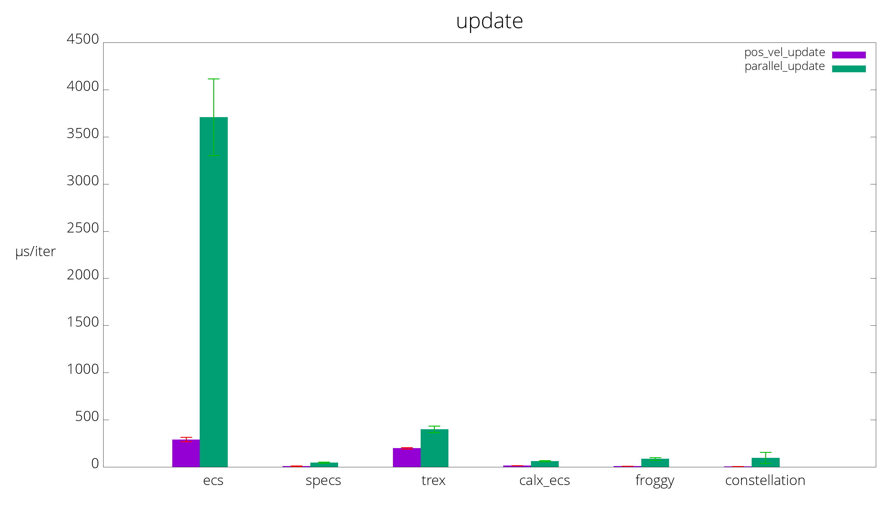
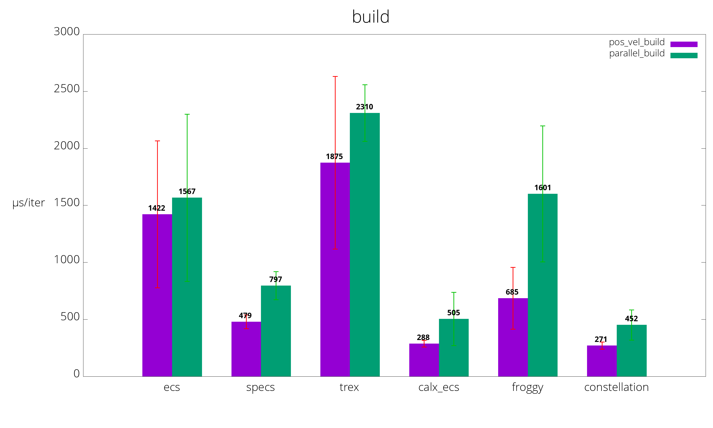

# Benchmarks of various Rust Entity Component Systems

## Benchmarks
Benchmarks are run on [Travis CI](https://travis-ci.org/lschmierer/ecs_bench/).

Benchmarks are located in `benches/[bench_name]_[ecs_crate_name].rs`.

 Library         | pos_vel build                 | pos_vel update                 | parallel build                 | parallel update
 --------------- |:-----------------------------:|:------------------------------:|:------------------------------:|:--------------------------------:
 [calx-ecs]      | 228 µs/iter (+/- 7)      | 18 µs/iter (+/- 0)      | 385 µs/iter (+/- 18)      | 76 µs/iter (+/- 1)
 [constellation] | 280 µs/iter (+/- 8) | 8 µs/iter (+/- 0) | 455 µs/iter (+/- 6) | 152 µs/iter (+/- 13)
 [ecs]           | 1,452 µs/iter (+/- 39)           | 324 µs/iter (+/- 29)           | 1,380 µs/iter (+/- 29)           | 3,644 µs/iter (+/- 74)
 [froggy]        | 589 µs/iter (+/- 10)        | 8 µs/iter (+/- 0)        | 1,429 µs/iter (+/- 65)        | 73 µs/iter (+/- 2)
 [specs]         | 261 µs/iter (+/- 7)         | 3 µs/iter (+/- 0)         | 675 µs/iter (+/- 88)         | 87 µs/iter (+/- 1)
 [trex]          | 1,094 µs/iter (+/- 81)          | 179 µs/iter (+/- 2)          | 1,637 µs/iter (+/- 172)          | 379 µs/iter (+/- 11)

[calx-ecs]: https://github.com/rsaarelm/calx-ecs
[constellation]: https://github.com/TomGillen/constellation/
[ecs]: https://github.com/HeroesGrave/ecs-rs
[froggy]: https://github.com/kvark/froggy
[specs]: https://github.com/slide-rs/specs
[trex]: https://github.com/rcolinray/trex

Visualization of benchmarks, smaller is better.

### pos_vel
 * 1000 entities with `position` and `velocity` components
 * 9000 entities with `position` components only
 * stub `render` system
 * `physics` system: `position += velocity`

### parallel
 * 10000 entities with 3 simple components `R`, `W1` and `W2`
 * `w1` system reads `R` and writes to `W1`
 * `w2` system reads `R` and writes to `W2`
 * systems could be run in parallel

## Notes
 * the benchmarks explore a limited subset of ECS use-cases and do not necessarily reflect the peformance of large-scale applications
 * [froggy](https://github.com/kvark/froggy) is technically not an ECS, but a Component Graph System (CGS)
