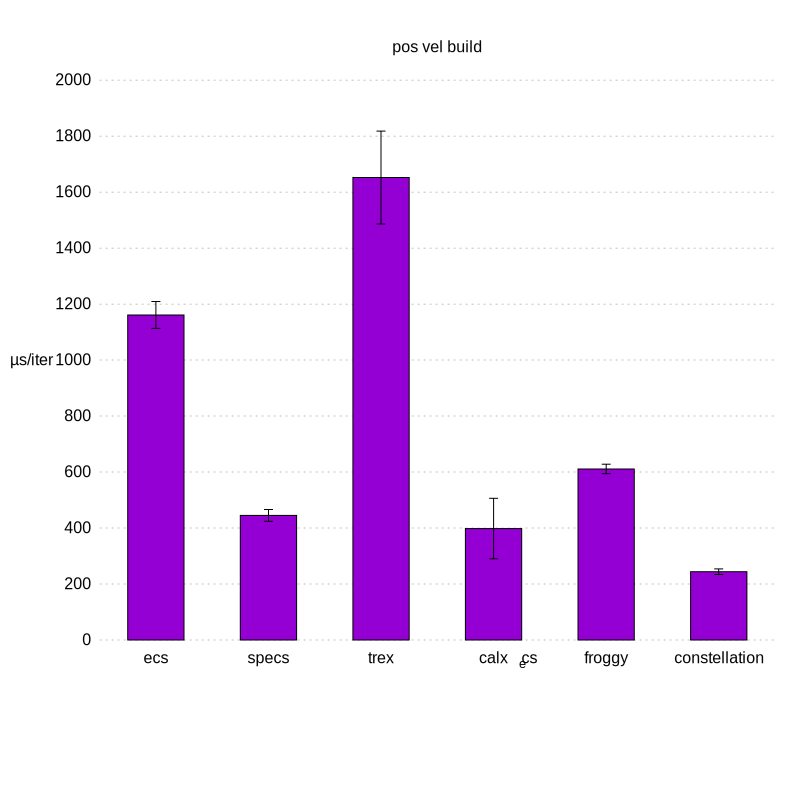
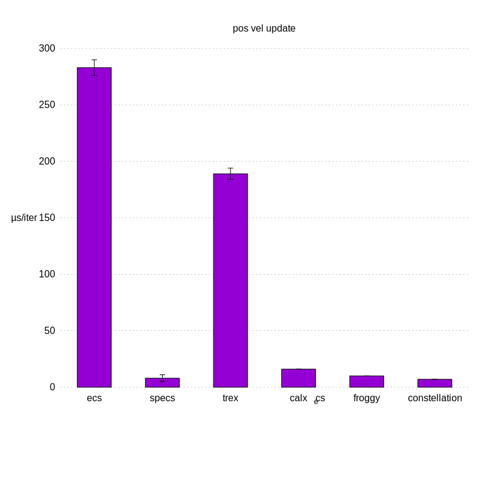
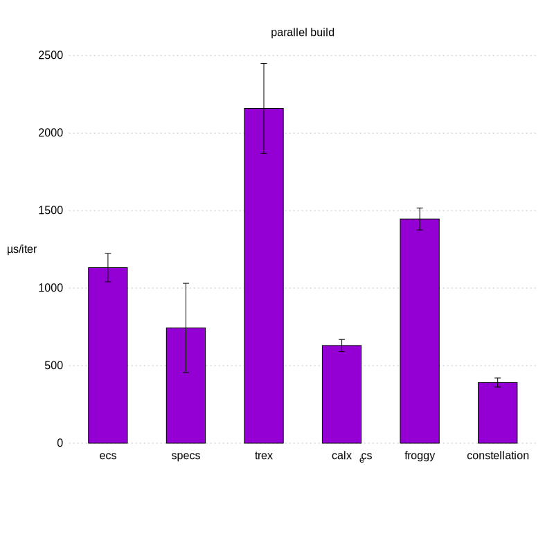
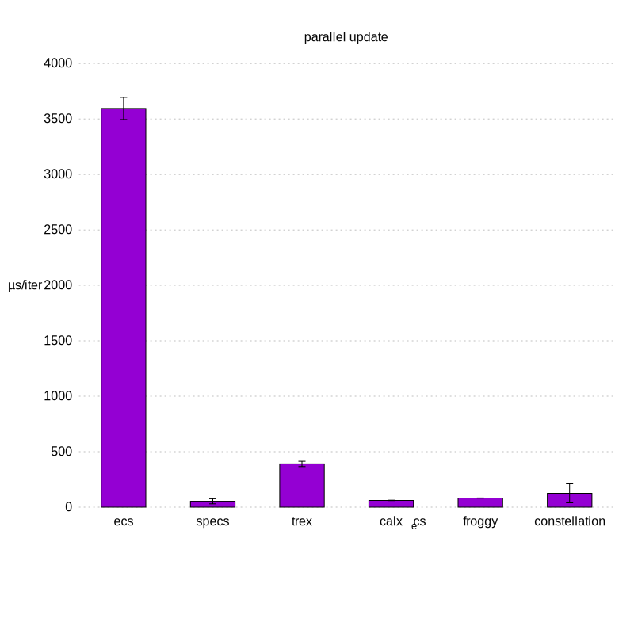

# Benchmarks of various Rust Entity Component Systems

## Benchmarks
Benchmarks are run on [Travis CI](https://travis-ci.org/lschmierer/ecs_bench/).

Benchmarks are located in `benches/[bench_name]_[ecs_crate_name].rs`.

 Library         | pos_vel build                 | pos_vel update                 | parallel build                 | parallel update
 --------------- |:-----------------------------:|:------------------------------:|:------------------------------:|:--------------------------------:
 [calx-ecs]      | 250 µs/iter (+/- 38)      | 16 µs/iter (+/- 0)      | 638 µs/iter (+/- 107)      | 62 µs/iter (+/- 5)
 [constellation] | 244 µs/iter (+/- 8) | 7 µs/iter (+/- 0) | 389 µs/iter (+/- 18) | 132 µs/iter (+/- 122)
 [ecs]           | 1,194 µs/iter (+/- 80)           | 286 µs/iter (+/- 11)           | 1,254 µs/iter (+/- 234)           | 3,684 µs/iter (+/- 174)
 [froggy]        | 620 µs/iter (+/- 35)        | 10 µs/iter (+/- 0)        | 1,458 µs/iter (+/- 79)        | 86 µs/iter (+/- 22)
 [recs]          | {pos_vel_build_recs}          | {pos_vel_update_recs}          | {parallel_build_recs}          | {parallel_update_recs}
 [specs]         | 469 µs/iter (+/- 84)         | 8 µs/iter (+/- 2)         | 679 µs/iter (+/- 72)         | 50 µs/iter (+/- 10)
 [trex]          | 1,603 µs/iter (+/- 89)          | 193 µs/iter (+/- 10)          | 2,079 µs/iter (+/- 211)          | 391 µs/iter (+/- 21)

[calx-ecs]: https://github.com/rsaarelm/calx-ecs
[constellation]: https://github.com/TomGillen/constellation/
[ecs]: https://github.com/HeroesGrave/ecs-rs
[froggy]: https://github.com/kvark/froggy
[recs]: https://github.com/andybarron/rustic-ecs
[specs]: https://github.com/slide-rs/specs
[trex]: https://github.com/rcolinray/trex

### pos_vel
 * 1000 entities with `position` and `velocity` components
 * 9000 entities with `position` components only
 * stub `render` system
 * `physics` system: `position += velocity`

### parallel
 * 10000 entities with 3 simple components `R`, `W1` and `W2`
 * `w1` system reads `R` and writes to `W1`
 * `w2` system reads `R` and writes to `W2`
 * systems could be run in parallel

## Notes
 * the benchmarks explore a limited subset of ECS use-cases and do not necessarily reflect the peformance of large-scale applications
 * [froggy](https://github.com/kvark/froggy) is technically not an ECS, but a Component Graph System (CGS)
