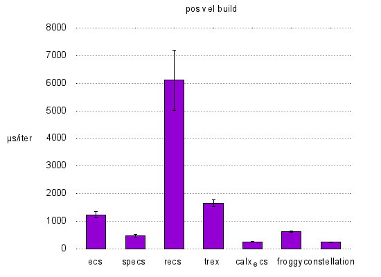
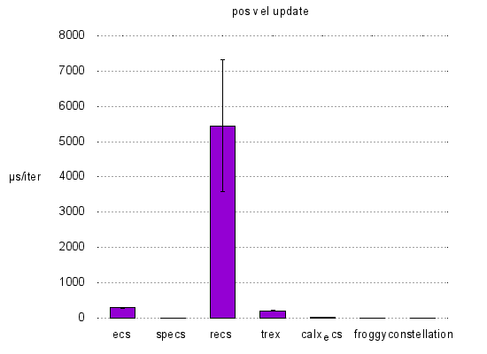
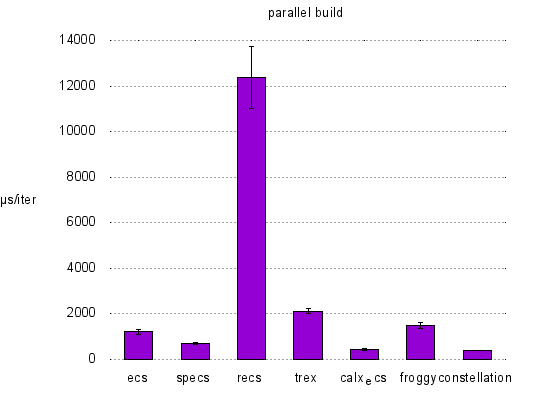
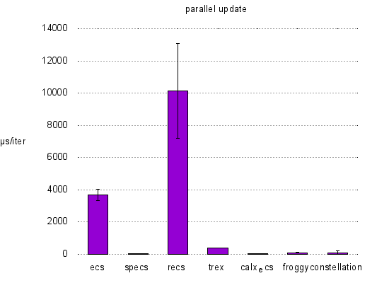

# Benchmarks of various Rust Entity Component Systems

## Benchmarks
Benchmarks are run on [Travis CI](https://travis-ci.org/lschmierer/ecs_bench/).

Benchmarks are located in `benches/[bench_name]_[ecs_crate_name].rs`.

 Library         | pos_vel build                 | pos_vel update                 | parallel build                 | parallel update
 --------------- |:-----------------------------:|:------------------------------:|:------------------------------:|:--------------------------------:
 [calx-ecs]      | 261 µs/iter (+/- 9)      | 16 µs/iter (+/- 0)      | 440 µs/iter (+/- 29)      | 62 µs/iter (+/- 1)
 [constellation] | 243 µs/iter (+/- 10) | 7 µs/iter (+/- 0) | 394 µs/iter (+/- 19) | 101 µs/iter (+/- 108)
 [ecs]           | 1,237 µs/iter (+/- 113)           | 290 µs/iter (+/- 14)           | 1,213 µs/iter (+/- 121)           | 3,703 µs/iter (+/- 349)
 [froggy]        | 630 µs/iter (+/- 20)        | 10 µs/iter (+/- 0)        | 1,488 µs/iter (+/- 115)        | 93 µs/iter (+/- 24)
 [recs]          | 6,111 µs/iter (+/- 1,098)          | 5,443 µs/iter (+/- 1,868)          | 12,390 µs/iter (+/- 1,354)          | 10,143 µs/iter (+/- 2,941)
 [specs]         | 477 µs/iter (+/- 40)         | 9 µs/iter (+/- 1)         | 710 µs/iter (+/- 36)         | 47 µs/iter (+/- 2)
 [trex]          | 1,648 µs/iter (+/- 122)          | 202 µs/iter (+/- 12)          | 2,125 µs/iter (+/- 113)          | 395 µs/iter (+/- 12)

[calx-ecs]: https://github.com/rsaarelm/calx-ecs
[constellation]: https://github.com/TomGillen/constellation/
[ecs]: https://github.com/HeroesGrave/ecs-rs
[froggy]: https://github.com/kvark/froggy
[recs]: https://github.com/andybarron/rustic-ecs
[specs]: https://github.com/slide-rs/specs
[trex]: https://github.com/rcolinray/trex

### pos_vel
 * 1000 entities with `position` and `velocity` components
 * 9000 entities with `position` components only
 * stub `render` system
 * `physics` system: `position += velocity`

### parallel
 * 10000 entities with 3 simple components `R`, `W1` and `W2`
 * `w1` system reads `R` and writes to `W1`
 * `w2` system reads `R` and writes to `W2`
 * systems could be run in parallel

## Notes
 * the benchmarks explore a limited subset of ECS use-cases and do not necessarily reflect the peformance of large-scale applications
 * [froggy](https://github.com/kvark/froggy) is technically not an ECS, but a Component Graph System (CGS)
