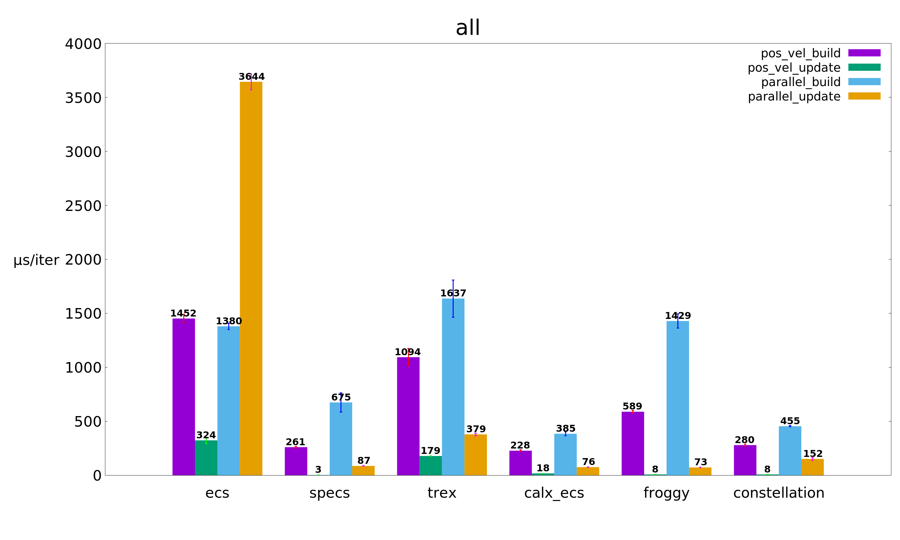

# Benchmarks of various Rust Entity Component Systems

## Benchmarks
Benchmarks are run on [Travis CI](https://travis-ci.org/lschmierer/ecs_bench/).

Benchmarks are located in `benches/[bench_name]_[ecs_crate_name].rs`.

 Library         | pos_vel build                 | pos_vel update                 | parallel build                 | parallel update
 --------------- |:-----------------------------:|:------------------------------:|:------------------------------:|:--------------------------------:
 [calx-ecs]      | 256 µs/iter (+/- 12)      | 17 µs/iter (+/- 0)      | 405 µs/iter (+/- 30)      | 62 µs/iter (+/- 5)
 [constellation] | 243 µs/iter (+/- 11) | 7 µs/iter (+/- 0) | 397 µs/iter (+/- 27) | 95 µs/iter (+/- 31)
 [ecs]           | 1,244 µs/iter (+/- 114)           | 290 µs/iter (+/- 22)           | 1,202 µs/iter (+/- 54)           | 3,639 µs/iter (+/- 174)
 [froggy]        | 635 µs/iter (+/- 36)        | 10 µs/iter (+/- 0)        | 1,446 µs/iter (+/- 133)        | 85 µs/iter (+/- 3)
 [recs]          | 5,171 µs/iter (+/- 777)          | 4,193 µs/iter (+/- 1,041)          | 12,089 µs/iter (+/- 1,133)          | 8,614 µs/iter (+/- 1,295)
 [specs]         | 476 µs/iter (+/- 15)         | 8 µs/iter (+/- 1)         | 704 µs/iter (+/- 55)         | 47 µs/iter (+/- 0)
 [trex]          | 1,698 µs/iter (+/- 144)          | 200 µs/iter (+/- 8)          | 2,096 µs/iter (+/- 154)          | 385 µs/iter (+/- 18)

[calx-ecs]: https://github.com/rsaarelm/calx-ecs
[constellation]: https://github.com/TomGillen/constellation/
[ecs]: https://github.com/HeroesGrave/ecs-rs
[froggy]: https://github.com/kvark/froggy
[recs]: https://github.com/andybarron/rustic-ecs
[specs]: https://github.com/slide-rs/specs
[trex]: https://github.com/rcolinray/trex

### pos_vel
 * 1000 entities with `position` and `velocity` components
 * 9000 entities with `position` components only
 * stub `render` system
 * `physics` system: `position += velocity`

### parallel
 * 10000 entities with 3 simple components `R`, `W1` and `W2`
 * `w1` system reads `R` and writes to `W1`
 * `w2` system reads `R` and writes to `W2`
 * systems could be run in parallel

## Notes
 * the benchmarks explore a limited subset of ECS use-cases and do not necessarily reflect the peformance of large-scale applications
 * [froggy](https://github.com/kvark/froggy) is technically not an ECS, but a Component Graph System (CGS)
